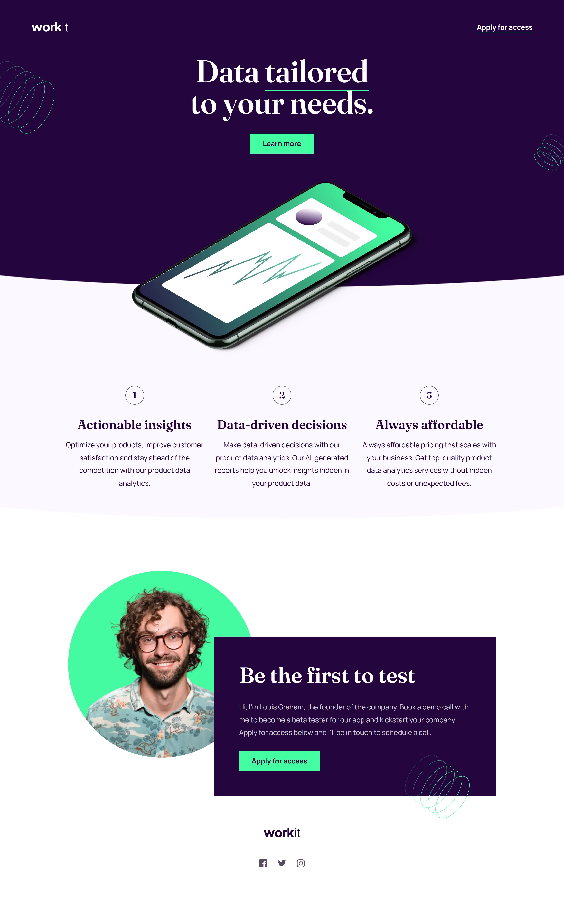

# Frontend Mentor - Workit landing page solution

This is a solution to the [Workit landing page challenge on Frontend Mentor](https://www.frontendmentor.io/challenges/workit-landing-page-2fYnyle5lu). Frontend Mentor challenges help you improve your coding skills by building realistic projects.

## Overview

### The challenge

Users should be able to:

- View the optimal layout for the interface depending on their device's screen size
- See hover and focus states for all interactive elements on the page

### Screenshot

## My process

### Built with

- Semantic HTML5 markup
- CSS custom properties
- Flexbox
- Mobile-first workflow

### Useful resources

- https://clamp.font-size.app/?config=eyJyb290IjoiMTYiLCJtaW5XaWR0aCI6IjMyMHB4IiwibWF4V2lkdGgiOiIxMjAwcHgiLCJtaW5Gb250U2l6ZSI6IjQwcHgiLCJtYXhGb250U2l6ZSI6IjgwcHgifQ%3D%3D - This helped me on calculating font size, it's a real shortcut. I really liked this pattern and will use it going forward.
- https://www.w3schools.com/css/css_font_shorthand.asp - Fonts shorthand, that was a nice shortcut and fits with the info provided on figma
